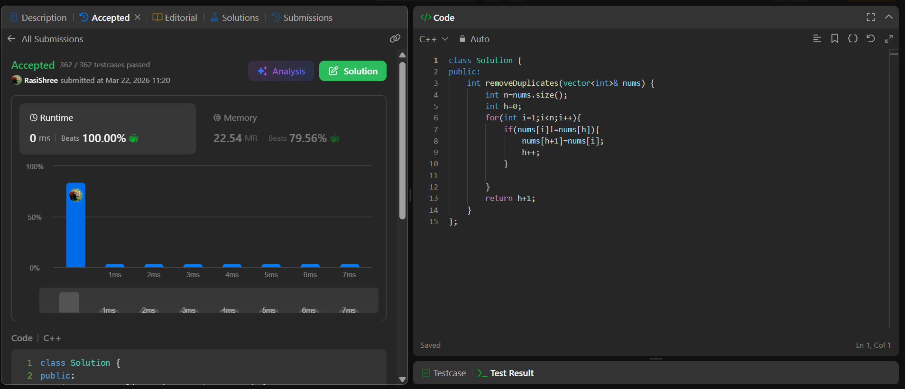

#Code
class Solution {
public:
    int removeDuplicates(vector<int>& nums) {
        int n=nums.size();
        int h=0;
        for(int i=1;i<n;i++){
            if(nums[i]!=nums[h]){
                nums[h+1]=nums[i];
                h++;
            }

        }
        return h+1;    
    }
};

## Screenshot:

